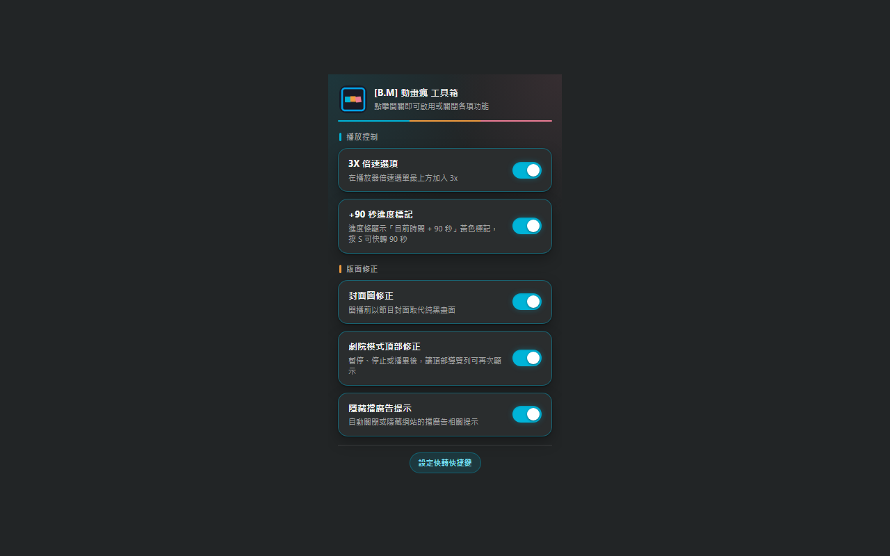

# [B.M] 動畫瘋 工具箱

[](https://developer.chrome.com/docs/extensions/mv3/)
[](https://ani.gamer.com.tw)
[](https://github.com/BoringMan314/bm-ani-gamer-tool)
[](https://github.com/BoringMan314/bm-ani-gamer-tool/releases)
[](LICENSE)

適用於 [巴哈姆特動畫瘋](https://ani.gamer.com.tw)（`ani.gamer.com.tw`）的瀏覽器擴充功能：將 **3X 倍速**、**+90 秒進度標記**、**封面圖修正**、**劇院模式頂部列修正** 與 **隱藏擋廣告提示** 多項功能整合為單一擴充，並可在彈出視窗中**逐項開關**。

*将 3X 倍速、+90 秒进度标记、封面图修正、剧院模式顶部栏修正与隐藏挡广告提示整合为单一扩展，可逐项开关。*  

*3倍速・+90秒マーカー・カバー画像修正・シアターモード上部バー修正・広告ブロック警告の非表示を 1 つの拡張機能に統合し、個別にオン／オフできます。*  

*Combines 3× speed, +90s marker, cover image fix, theater top bar fix, and ad-block notice hiding into one extension with per-feature toggles.*

> **聲明**：本專案為第三方輔助工具，與動畫瘋／巴哈姆特官方無關。使用請遵守該站服務條款與著作權規範。

---



---


## 目錄

- [功能](#功能)
- [整合來源](#整合來源)
- [系統需求](#系統需求)
- [安裝方式](#安裝方式)
- [本機開發與測試](#本機開發與測試)
- [技術概要](#技術概要)
- [專案結構](#專案結構)
- [版本與多語系](#版本與多語系)
- [隱私說明](#隱私說明)
- [維護者：更新 GitHub 與 Chrome 線上應用程式商店](#維護者更新-github-與-chrome-線上應用程式商店)
- [授權](#授權)
- [問題與建議](#問題與建議)

---


## 功能

點擊工具列的擴充功能圖示可開啟彈出視窗，以開關逐項控制下列功能（**預設全部開啟**，狀態存於 `chrome.storage.local`，變更後分頁即時套用，無須重新整理）：

**播放控制**


| 功能            | 說明                                                                                                |
| ------------- | ------------------------------------------------------------------------------------------------- |
| **3X 倍速選項**   | 在 Video.js 播放器的倍速選單**最上方**加入 **3x**（外觀與站方內建項目一致），點選後將影片 `playbackRate` 設為 `3`。                    |
| **+90 秒進度標記** | 在進度條上以黃色細線標示「**目前時間 + 90 秒**」的位置；按 `S` 或自訂快捷鍵（預設 `Ctrl+Shift+S`／macOS `Command+Shift+S`）可快轉 90 秒。 |


**版面修正**


| 功能           | 說明                                                                                                                                            |
| ------------ | --------------------------------------------------------------------------------------------------------------------------------------------- |
| **封面圖修正**    | 影片頁開播前的**純黑畫面**改以節目**封面圖**作為背景（含 R18 遮罩區塊）。                                                                                                   |
| **劇院模式頂部修正** | 劇院（全螢幕版面）模式下影片 **pause / ended / emptied** 時，讓 `.top_sky` 頂部區塊恢復可見，並修正 `.vjs-title-bar` 透明度。                                                  |
| **隱藏擋廣告提示**  | 自動關閉／隱藏網站的擋廣告相關提示（`Dialogify` 對話框與底部白名單橫幅）。關閉開關後會移除隱藏樣式並嘗試重新開啟提示；但站方的擋廣告偵測**只在頁面載入時執行一次**，且已關閉的對話框可能已被站方從 DOM 移除，因此關閉開關後通常需**重新整理頁面**才會再看到提示。 |


- 僅在 `https://ani.gamer.com.tw/*` 載入；[`manifest.json`](manifest.json) 未宣告 `host_permissions`，不額外請求其他網域。
- 關閉任一開關時，該功能會**還原**其對頁面所做的變更（移除注入樣式、標記元素與選單項目等）。
- 若動畫瘋改版播放器 DOM 或 class 命名，可能需調整 [`src/`](src/) 內對應功能模組的選取邏輯。


### 快捷鍵說明

- `S`**（單鍵）**：固定快捷鍵；當使用者在瀏覽器將 `skip90` 指令改為**非預設**組合時會自動停用，避免衝突。
- `Ctrl+Shift+S`：可在 `chrome://extensions/shortcuts` 自訂；彈出視窗底部的「**設定快轉快捷鍵**」按鈕可直接開啟該頁。

---


## 整合來源

本專案由下列四個獨立擴充功能整合而成，功能邏輯沿用原專案並改為可開關的模組：


| 來源專案                                                                                         | 對應功能開關                     |
| -------------------------------------------------------------------------------------------- | -------------------------- |
| [bm-ani-gamer-3x](https://github.com/BoringMan314/bm-ani-gamer-3x)                           | 3X 倍速選項（`speed3x`）         |
| [bm-ani-gamer-time-indicator](https://github.com/BoringMan314/bm-ani-gamer-time-indicator)   | +90 秒進度標記（`timeIndicator`） |
| [bm-ani-gamer-cover-image-fix](https://github.com/BoringMan314/bm-ani-gamer-cover-image-fix) | 封面圖修正（`coverImage`）        |
| [bm-ani-gamer-topbar-fix](https://github.com/BoringMan314/bm-ani-gamer-topbar-fix)           | 劇院模式頂部修正（`theaterTopbar`）  |


> 若已安裝上述任一獨立擴充，建議**停用或移除**後再安裝本工具箱，避免兩者同時操作同一 DOM。

---


## 系統需求

- **Chrome** 或 **Microsoft Edge**（Chromium）等支援 **Manifest V3** 的瀏覽器。

---


## 安裝方式


### 從原始碼載入（開發人員模式）

1. 點選本頁綠色 **Code** → **Download ZIP** 解壓，或執行 `git clone https://github.com/BoringMan314/bm-ani-gamer-tool.git` 複製本倉庫。
2. 以 **Chrome** 或 **Microsoft Edge** 開啟 `chrome://extensions`（在 Edge 為 `edge://extensions`）。
3. 開啟「**開發人員模式**」→「**載入未封裝項目**」→ 選取含 [`manifest.json`](manifest.json) 的**專案根目錄**（勿選子資料夾）。
4. 開啟動畫瘋任一有影片的頁面，重新整理後即可驗證各項功能；點擊工具列圖示可調整開關。

---


## 本機開發與測試

1. 修改 [`src/`](src/) 內的功能模組、[`content.css`](content.css) 或 `popup.*` 後，在 `chrome://extensions` 將本擴充**重新載入**。
2. 重新整理動畫瘋分頁，逐項驗證：
  - **3x**：倍速選單最上方出現 `3x`，點選後影片明顯加速。
  - **+90 秒標記**：進度條出現黃色細線；按 `S` 可快轉。
  - **封面圖**：開播前顯示封面而非純黑。
  - **劇院頂部列**：按 `T` 進入劇院模式，暫停或播畢後頂部列可再次顯示。
  - **擋廣告提示**：相關對話框與底部橫幅不再出現。
3. 逐一關閉開關，確認上述變更皆能**還原**。
4. 專案採用 [Prettier](https://prettier.io/)（設定見 [`.prettierrc.json`](.prettierrc.json)：tab 縮排、單引號）。

---


## 技術概要

- **彈出視窗** [`popup.html`](popup.html) / [`popup.js`](popup.js)：五個功能開關，變更寫入 `chrome.storage.local`。
- **彈出視窗配色** [`popup.css`](popup.css)：採動畫瘋站方深色版面底色（`#222526`、`#1B1D1E`）與巴哈姆特標誌三色 — 青 `#00B4D8`（主要強調色與開關開啟狀態）、橙 `#EF9B3F`、粉 `#EA7B94`（標題分隔線與分組色標）。
- **共用預設值** [`src/defaults.js`](src/defaults.js)：開關鍵名與預設值的單一來源，內容腳本與彈出視窗共用。
- **設定中樞** [`src/core.js`](src/core.js)：載入設定並監看 `storage.onChanged`，以 `bmAniTool.register({ key, setEnabled })` 通知各功能模組啟用／停用；單一模組拋錯不影響其他模組。
- **功能模組** `src/feature-*.js`：各自處理啟用與還原邏輯，並以 `MutationObserver` 因應站方 DOM 變化。
- **頁面脈絡腳本** [`src/injected-speed-3x.js`](src/injected-speed-3x.js)：倍速選單需在網頁原生 JS 環境操作 Video.js 選單 DOM，故由內容腳本注入；開關狀態透過 `<html>` 的 `data-bm-ani-3x` 屬性傳遞（兩個世界共用同一份 DOM）。
- **背景服務** [`background.js`](background.js)：處理 `skip90` 快捷鍵指令，並回報使用者是否已自訂快捷鍵（供內容腳本決定是否停用固定單鍵 `S`）。
- **樣式覆寫** [`content.css`](content.css)：僅在 `<html>` 帶有對應功能 class（`ag-feature-theater`、`ag-feature-hide-adblock`）時生效。
- **框架範圍**：內容腳本以 `all_frames: true` 載入；需要站方版面元素的功能（劇院頂部列、擋廣告提示）在模組內限定僅於最上層框架執行。

---


## 專案結構


| 路徑                                                                             | 說明                                           |
| ------------------------------------------------------------------------------ | -------------------------------------------- |
| [`manifest.json`](manifest.json)                                               | Manifest V3 設定：內容腳本、`action` 彈出視窗、背景服務、快捷鍵指令 |
| [`popup.html`](popup.html) / [`popup.css`](popup.css) / [`popup.js`](popup.js) | 工具列圖示彈出視窗與五項功能開關                             |
| [`background.js`](background.js)                                               | 快捷鍵指令轉送與快捷鍵狀態查詢                              |
| [`content.css`](content.css)                                                   | 依功能開關套用的樣式覆寫                                 |
| [`src/defaults.js`](src/defaults.js)                                           | 功能開關預設值與正規化                                  |
| [`src/core.js`](src/core.js)                                                   | 設定載入、變更監看與功能模組註冊                             |
| [`src/feature-speed-3x.js`](src/feature-speed-3x.js)                           | 3X 倍速：注入頁面脈絡腳本並傳遞開關狀態                        |
| [`src/injected-speed-3x.js`](src/injected-speed-3x.js)                         | 3X 倍速：建立選單項目並設定播放速率（頁面脈絡）                    |
| [`src/feature-time-indicator.js`](src/feature-time-indicator.js)               | +90 秒進度標記與快轉邏輯                               |
| [`src/feature-cover-image.js`](src/feature-cover-image.js)                     | 封面圖取得、樣式注入與還原                                |
| [`src/feature-theater-topbar.js`](src/feature-theater-topbar.js)               | 劇院模式偵測與頂部列顯示同步                               |
| [`src/feature-adblock-prompt.js`](src/feature-adblock-prompt.js)               | 擋廣告提示隱藏與還原                                   |
| [`_locales/`](_locales/)                                                       | 多語系字串（`zh_TW`、`zh_CN`、`ja`、`en_US`）          |
| [`privacy-policy.html`](privacy-policy.html)                                   | 隱私權政策（上架商店所需之公開網頁）                           |
| [`icons/`](icons/)                                                             | 工具列與商店用圖示：icon.png                           |
| [`screenshot/`](screenshot/)                                                   | 商店與說明用截圖                                     |


---


## 版本與多語系

- **版本**：以 [`manifest.json`](manifest.json) 的 `version` 為準。
- **預設語系**：`zh_TW`（`default_locale`）。
- **內建語系**：`zh_TW`、`zh_CN`、`ja`、`en_US`（路徑為 `_locales/<code>/messages.json`）。實際顯示依瀏覽器語系與遞減規則。

---


## 隱私說明

本擴充**不蒐集、不上傳**可識別個人之帳戶或瀏覽內容；**未內建**遠端可執行程式、分析或廣告追蹤。功能開關僅透過瀏覽器 `storage` 保存在本機。詳見 [`privacy-policy.html`](privacy-policy.html)。

**上架提醒**：若上架 Chrome Web Store，須在開發人員後台完成隱私實踐聲明，並提供本政策之**公開 HTTPS 網址**（建議以 [GitHub Pages](https://pages.github.com/) 託管專案內的 `privacy-policy.html`）。

---


## 維護者：更新 GitHub 與 Chrome 線上應用程式商店


### 更新至 GitHub

**Bash / Git Bash / PowerShell：**

```powershell
git add .
git commit -m "docs: 更新內容說明與商店連結"
git push origin main
```


### 更新至 Chrome 線上應用程式商店

請透過 [Chrome Web Store 開發人員控制台](https://chrome.google.com/webstore/devconsole) 手動上傳更新：

1. **遞增版本**：修改 `manifest.json` 中的 `version`（例如從 `0.1.0` 提升至 `0.1.1`）。
2. **封裝套件**：將專案內容壓縮為 ZIP 檔。
  - **必要檔案**：`manifest.json`, `background.js`, `content.css`, `popup.html`, `popup.css`, `popup.js`, `src/`, `privacy-policy.html`, `icons/`, `_locales/`
  - **建議不打包**：`.git/`, `.gitignore`, `README.md`, `screenshot/`, `*.psd`, `*.zip`, `*.url`
3. **上傳審核**：在控制台選擇項目 →「套件」→「上傳新套件」。
4. **提交送審**：確認版號、商店文案、截圖、隱私欄位與 `privacy-policy` 公開網址無誤後，點擊「**提交送審**」。

---


## 授權

本專案以 [MIT License](LICENSE) 授權。

---


## 問題與建議

歡迎透過 [GitHub Issues](https://github.com/BoringMan314/bm-ani-gamer-tool/issues) 回報錯誤或提出改善建議。回報時請一併提供瀏覽器版本、**介面語言**、**哪一項功能開關**及重現步驟；若牽涉劇院模式，請註明是否為劇院模式與重現路徑。